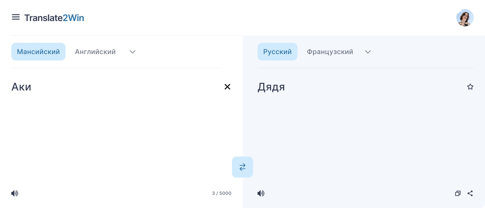
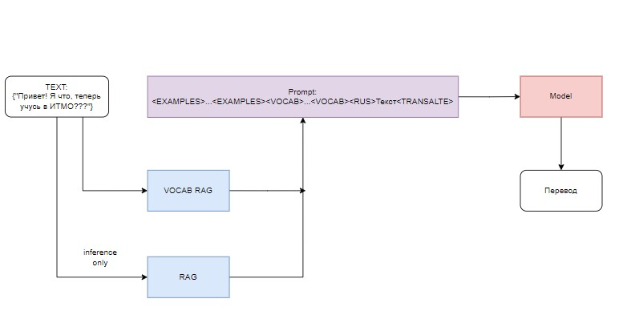

# Веб-сервис для русско-мансийского перевода текста

## Решение команды: **Translate2Win**


### ✍️ Описание решения

Наше решение является сервисом, который позволит пользователям переводить текст с русского языка на мансийский, обеспечивая точный и быстрый перевод для личного и профессионального использования.




<Описание модулей архитектуры>


### ⛏️ Майним данные
Специализированные онлайн-словарные ресурсы, предоставляющие дополнительную лексическую информацию. Эти словари обеспечили широкий спектр терминов и их переводов, что способствовало созданию базовых переводческих соответствий.

1. https://dict.fu-lab.ru/dict-p?id=238837&page=1 

2. https://mansitranslator.ru/ 

### 🏭 Запускаем решение

Скачать репозиторий:
```
git clone link_to_repo
```

Запустить решение:
```
docker-compose up --build
```
