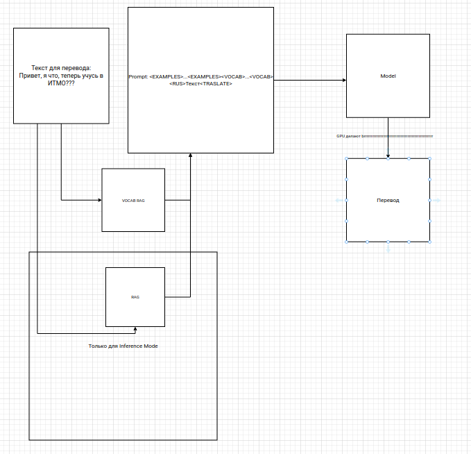

# Веб-сервис для русско-мансийского перевода текста

## Решение команды: **Translate2Win**


### ✍️ Описание решения

Наше решение является сервисом, который позволит пользователям переводить текст с русского языка на мансийский, обеспечивая точный и быстрый перевод для личного и профессионального использования.


<Описание модулей архитектуры>


### ⛏️ Майним данные
Описываем какие источники использовали

### 🏭 Запускаем решение

Скачать репозиторий:
```
git clone link_to_repo
```

Запустить решение:
```
docker-compose up --build
```